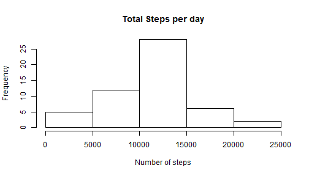
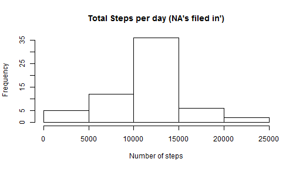
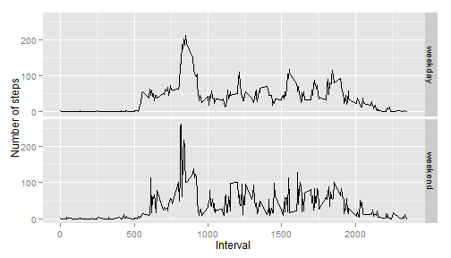

###Loading and processing data
1. Load the data


```r
 activity <- read.csv ("activity.csv", header = T)
```

2.Process/transform the data (if necessary) into a format suitable for your analysis.
At this stage the data was left as it was save in the original file.

### What is the mean total number of steps taken per day?
1. Make an histogram of the total number of steps taken each day


```r
steps_day <- aggregate ( steps ~ date , data=activity, sum)
# the total number of steps per day was calculated by summing the numer of steps
hist (steps_day$steps, main = "Total Steps per day", xlab="Number of steps", ylab="Frequency")
```

 

2. Calculate and report the mean and median total number of steps taken per day.


```r
 # mean and median of the total number of steps per day
options ("scipen"= 9999)
 
meanvalue <- mean(steps_day$steps)
medianvalue <-  median (steps_day$steps)
```

The mean is 10766.1886792 and the median is 10765.

### What is the average daily activity pattern?
1. Make a time series plot of the 5-minute interval and the average number of steps taken, averaged across all days (y-axis)


```r
 ##Steps by interval
 steps_interval <- aggregate ( steps ~ interval , data=activity, mean)
 
 ## plot
 steps_interval <-data.frame(steps_interval)

library (ggplot2) 
 ggplot(steps_interval, aes(x= interval,y =steps)) + geom_line()
```

 


2. Which 5-minute interval, on average across all the days in the dataset, containts the maximum number of steps?


```r
## Which 5 minute interval 
Maximumsteps<- max(steps_interval$steps)
 maxsteps <- steps_interval[steps_interval$steps == max(steps_interval$steps),]
intervalmax<- maxsteps[,"interval"]
```

The maximum  average number of steps is 206.1698113 and they occurs at the interval 835 .

### Imputing missing values
1. Calculate and report the total number of missing values in the dataset.

```r
#NA's
 NAs <- activity[is.na (activity$steps),]
 NAtotal <-nrow(NAs) #total numer of NA's
```
The total number of NAs is 2304 .

2. Strategy for filling missing values. 
When a record is NA it will get the mean for that five minute interval. I merged the original dataset (activity) with the output of the steps by interval.
Then I used and ifelse statement to create a new variable called "completesteps". If a record NA it will get the mean for that interval. The code is below.

3. Create a new dataset with the missing data filled in.
After merging I created a new dataset that includes only the number of steps (using the new variable), date and interval.


```r
 merged <-merge (activity, steps_interval, by = "interval") # merging original dataset with mean steps by interval output. 

 merged$completesteps <- ifelse (is.na(merged$steps.x), merged$steps.y, merged$steps.x) #creating new variable, replacin NA's by mean values by interval

 merged <- data.frame(merged)
 #create new dataset
 
newdataset <- merged [,c ("completesteps", "date", "interval") ]
```

4. Histogram of total number of steps using the new dataset.

```r
 #total steps per day including with filled in NA
 
 steps_daycomplete <- aggregate ( completesteps ~ date , data=newdataset, sum)
 #histogram of total number of steps with new dataset

 
 hist (steps_daycomplete$completesteps, main = "Total Steps per day (NA's filed in')", xlab="Number of steps", ylab="Frequency")
```

 

The meand and median were calculated using the new dataset.


```r
mean_newds<- mean(steps_daycomplete$completesteps)
median_newds<- median (steps_daycomplete$completesteps)
```
The mean is 10766.1886792 and the median is 10766.1886792. These values do not differ from the first estimates. With the new dataset the median and the mean are identical.

###Are the differences in activity patterns between weekdays and weekends?
1. Create a new factor variable with two levels-"weekday" and "weekend".

 

```r
newdataset$weekdays <- weekdays(as.Date(steps_daycomplete$date))
newdataset$weekend <- ifelse(newdataset$weekdays == 'Saturday'| newdataset$weekdays == 'Sunday', 'weekend', 'weekday')
```

2.Panel plot of a time series of the 5-minute interval (x-axis) and average number of steps. The information is presented by weekdays and weekends.


```r
 ##Steps by interval by weekday
 steps_interval_weekend <- aggregate ( completesteps ~ interval + weekend , data=newdataset, mean)
 
 
 plota<- ggplot(steps_interval_weekend, aes(x= interval,y =completesteps)) + geom_line()
 plota +facet_grid( weekend ~.) +labs (x= "Interval", y = "Number of steps")
```

 


